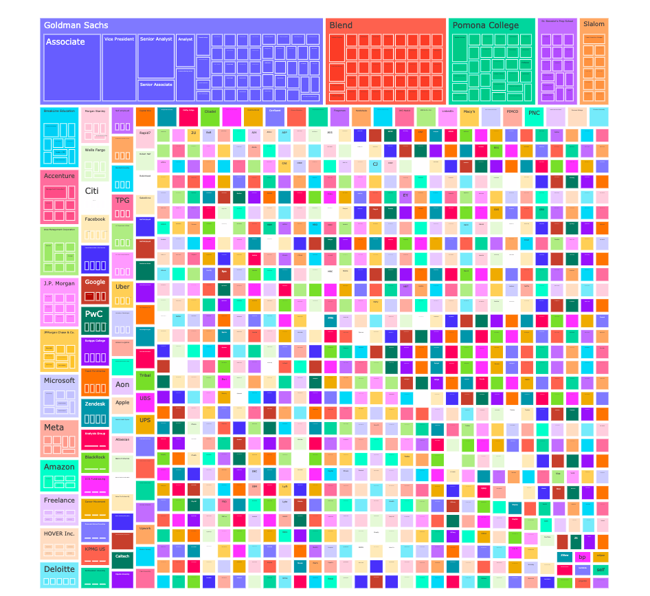
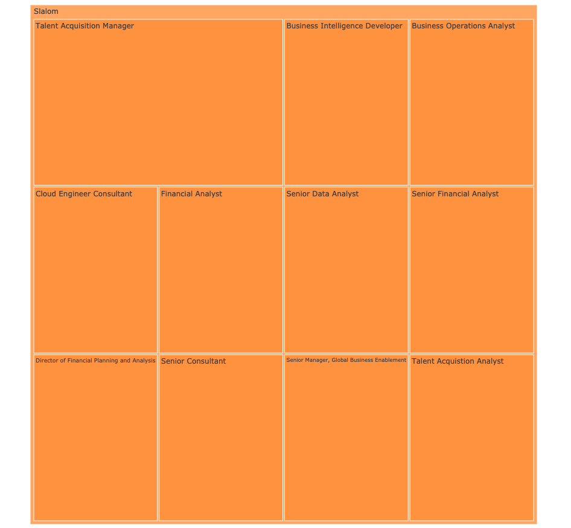
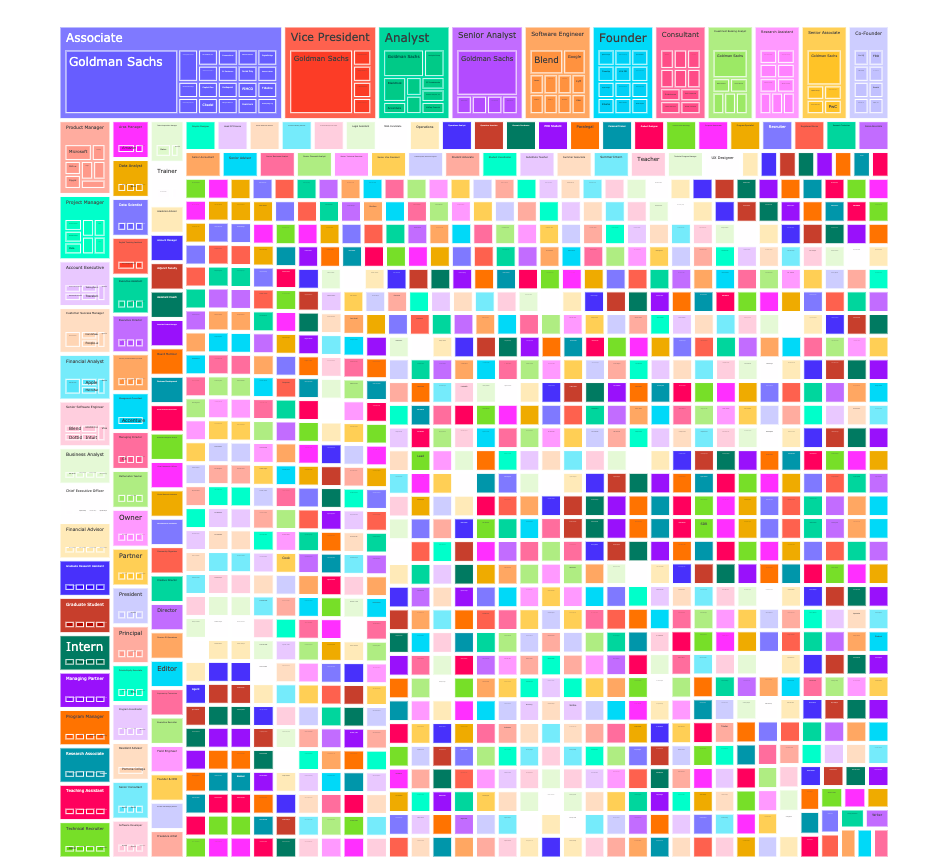

# Visualizing My Linkedin Network

As a budding data analytics professional, reading official and unofficial documentation and producing accessible reports is par the course. As an intellectual exercise, I am creating a data visualization of my LinkedIn network using an article from Medium as my "documentation". Second to that, this exercise is also an opportunity for me to use a new and  interesting dataset that branches towards #peopledata #peopleanalytics. Thanks for visiting my repository!

- Tech Stack: Python, Plotly
- Data: LinkedIn (.csv)
- Documentation: [_"Visualizing My Linkedin Network"_ | Medium | Tavish Gobindram Software Engineer](https://towardsdatascience.com/visualizing-my-linkedin-network-c4b232ab2ad0) 

## PRT. 1 - Where do those in my network work?

Herein, I have visualized where colleagues in my network work. Goldman Sachs, Blend, Pomona College, and Slalom Consulting are hubs for my colleagues, but still represent a minority. Most of my network is spread out, working at a large number of companies. 

## PRT. 2 - Additional Granularity Enabled by Plotly Library

To go down a layer deeper into the data, I clicked into Slalom to see the job roles of my colleagues. Hypothetically, if they were all Data Analysts like myself I would have a highly specialized set of of colleagues. What's going on in the visual here is that my network is a mix of stakeholders, more senior peers, other data professionals, and in-house recruiters.

## PRT. 3 - What roles do those in my network hold?

And, finally, this view shifts our perspective a bit. Above, I sliced my data from the company layer downward. Below, I have reorganized my data to see what job titles are most prominent. There are even fewer hubs here then in prt. 1 and there is a lot of variance in job titles.

## Additional Reporting Ideation
Using the "Connected On" column and a bit of reformatting using my pandas library, I suspect that I could identify when I gained the most connections throughout my time using Linkedin. From there, I might also be able to identify the why behind that spike in connections and use that information in growing my network in a meaningful way.

##### Appendix

* [_"Visualizing My Linkedin Network"_ | Medium | Tavish Gobindram Software Engineer](https://towardsdatascience.com/visualizing-my-linkedin-network-c4b232ab2ad0) - Source documentation used to generate dataviz here
